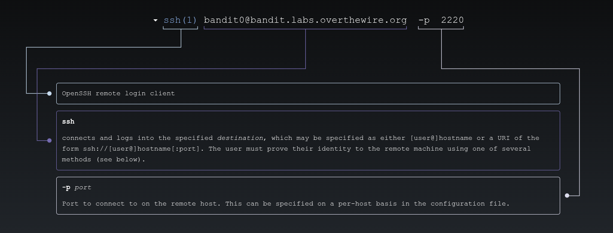
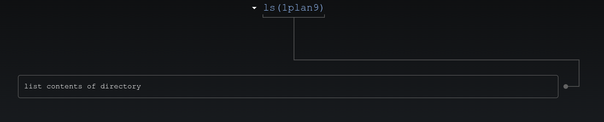
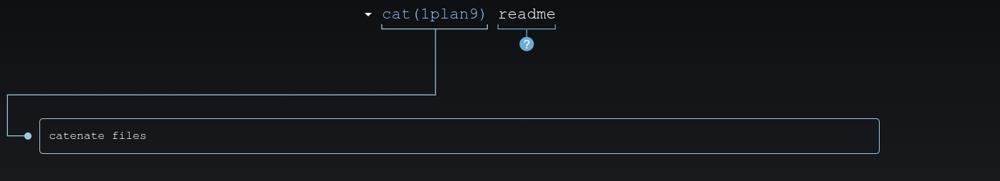

# 🎮 Bandit Level 0

---

## 📋 Level Info

| Info | Details |
|------|---------|
| **Host** | `bandit.labs.overthewire.org` |
| **Port** | `2220` |
| **Username** | `bandit0` |
| **Password** | `bandit0` |
| **Goal** | Connect via SSH and retrieve the password for Level 1 |

---

## 🔧 Tools/Commands Used

| Command | Purpose |
|---------|---------|
| `ssh` | Secure Shell — remote connection |
| `ls` | List files in current directory |
| `cat` | Display file contents |

---

## 🔍 Step-by-Step Solution

### Step 1: Connect to the Server

```bash
ssh bandit0@bandit.labs.overthewire.org -p 2220
```



**Password:** `bandit0`

> **My Advice:** Read the level goal carefully first. Then read the manual if you don't know what a command does.

---

### Step 2: Explore the Directory

```bash
bandit0@bandit:~$ ls
readme
```



We found a file called `readme`.

---

### Step 3: Read the File

```bash
bandit0@bandit:~$ cat readme
```



**Output:**
```
The password you are looking for is: 6y2kwnwK6grgvwvpvLaa2T1cpFEKOhNR
```

---

## 🎯 Password for Next Level

```
6y2kwnwK6grgvwvpvLaa2T1cpFEKOhNR
```

---

## 📚 What I Learned

| Concept | What I Learned |
|---------|----------------|
| **SSH Basics** | Remote connection with `ssh` and custom ports (`-p`) |
| **File Navigation** | `ls` to list what's there |
| **File Reading** | `cat` to view file contents |

**The Confusing Part:** At first, I didn't know what SSH does or why you need to specify a port. The answer: SSH is how you securely connect to remote machines, and the `-p` flag tells it which door to use when the default (22) isn't being used.

---

## ➡️ What's Next

# [Level 1 →](/overthewire/bandit/levels/level-1/)**
--- 

*This didn't feel like much when I first did it. But looking back — this was the first step. And every step after this builds on it.*