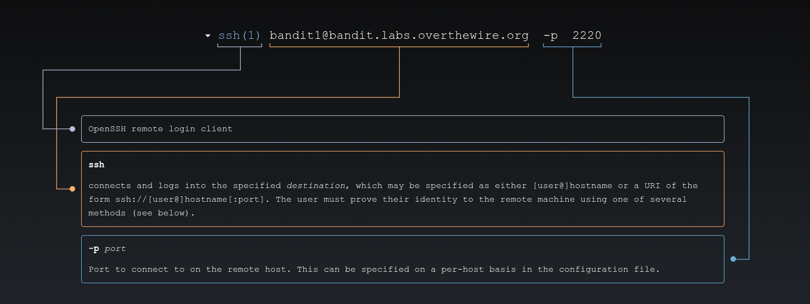
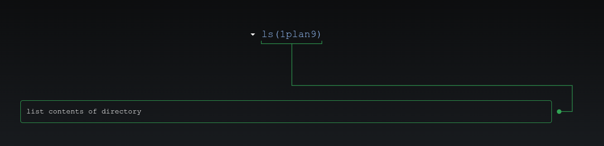
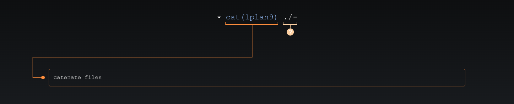

# 🎮 Bandit Level 1

---

## 📋 Level Info

| Info | Details |
|------|---------|
| **Host** | `bandit.labs.overthewire.org` |
| **Port** | `2220` |
| **Username** | `bandit1` |
| **Password** | `6y2kwnwK6grgvwvpvLaa2T1cpFEKOhNR` |
| **Goal** | Find the password for Level 2 in a file called `-` |

---

## 🔧 Tools/Commands Used

| Command | Purpose |
|---------|---------|
| `ssh` | Secure Shell — remote connection |
| `ls` | List files in current directory |
| `cat` | Display file contents |

---

## 🔍 Step-by-Step Solution

### Step 1: Connect to the Server

```bash
ssh bandit1@bandit.labs.overthewire.org -p 2220
```



**Password:** `6y2kwnwK6grgvwvpvLaa2T1cpFEKOhNR`

> **My Advice:** Read the level goal carefully. Notice the file is named `-` — that's unusual!

---

### Step 2: Explore the Directory

```bash
bandit1@bandit:~$ ls
-
```



We found a file called `-` (just a dash). This is tricky because `-` is a special character in Linux.

---

### Step 3: Read the File

```bash
bandit1@bandit:~$ cat ./-
PK8fYLZg2hnHSz83plBL1iEPKdD3QToB
```



**Why `./-`?** 
- `cat -` would read from standard input (keyboard), not a file
- `./-` tells Linux "look in the current directory for a file named `-`"
- The `./` means "current directory"

---

## 🎯 Password for Next Level

```
PK8fYLZg2hnHSz83plBL1iEPKdD3QToB
```

---

## 📚 What I Learned

| Concept | What I Learned |
|---------|----------------|
| **Special Filenames** | Files can have names like `-` that need special handling |
| **Current Directory** | `./` specifies the current directory |
| **Command vs File** | `cat -` means read from keyboard, not from a file |

**The Confusing Part:** At first, `cat -` didn't work because `-` is a special argument for many commands. I learned that `./-` tells the command to treat `-` as a filename, not a special option.

---

## ➡️ What's Next

**[Level 2 →](/overthewire/bandit/levels/level-2/)** *(Coming soon)*

---

*The file named `-` taught me that in Linux, filenames matter — and sometimes you need to be specific.*