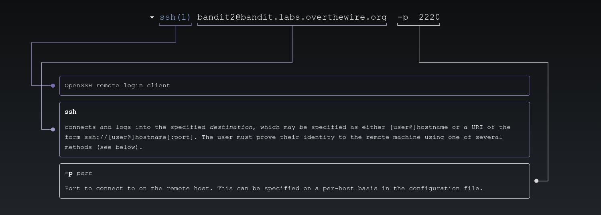
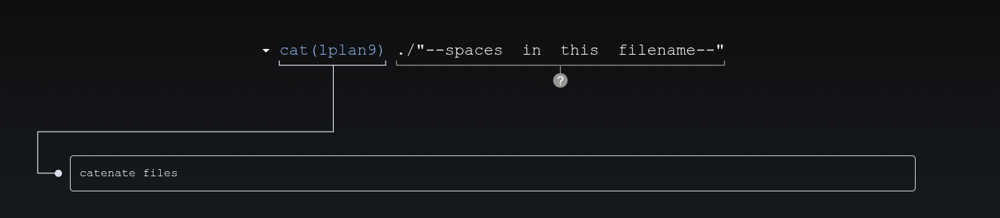

# 🎮 Bandit Level 2

---

## 📋 Level Info

| Info | Details |
|------|---------|
| **Host** | `bandit.labs.overthewire.org` |
| **Port** | `2220` |
| **Username** | `bandit2` |
| **Password** | `PK8fYLZg2hnHSz83plBL1iEPKdD3QToB` |
| **Goal** | Find the password for Level 3 in a file with spaces in its name |

---

## 🔧 Tools/Commands Used

| Command | Purpose |
|---------|---------|
| `ssh` | Secure Shell — remote connection |
| `ls` | List files in current directory |
| `cat` | Display file contents |

---

## 🔍 Step-by-Step Solution

### Step 1: Connect to the Server

```bash
ssh bandit2@bandit.labs.overthewire.org -p 2220
```



**Password:** `PK8fYLZg2hnHSz83plBL1iEPKdD3QToB`

> **My Advice:** Notice the file has spaces in its name — that's the challenge!

---

### Step 2: Explore the Directory

```bash
bandit2@bandit:~$ ls
--spaces in this filename--
```


We found a file with a tricky name: `--spaces in this filename--`

---

### Step 3: Try to Read the File (Wrong Way)

```bash
bandit2@bandit:~$ cat --spaces in this filename--
error: unexpected argument '--spaces' found
```

**Why doesn't this work?** The shell splits the filename into separate arguments because of the spaces.

---

### Step 4: Read the File (Correct Way)

**Option 1: Use quotes**
```bash
bandit2@bandit:~$ cat "--spaces in this filename--"
7ZZ2LFrykP2zEyvBl4m3clcL7tGYJPME
```

**Option 2: Use `./`**
```bash
bandit2@bandit:~$ cat ./"--spaces in this filename--"
7ZZ2LFrykP2zEyvBl4m3clcL7tGYJPME
```



**Why `./`?** The `./` tells the shell "look in the current directory," but the quotes handle the spaces.

---

## 🎯 Password for Next Level

```
7ZZ2LFrykP2zEyvBl4m3clcL7tGYJPME
```

---

## 📚 What I Learned

| Concept | What I Learned |
|---------|----------------|
| **Spaces in Filenames** | Files can have spaces, but you need to quote them |
| **Quoting** | `"filename with spaces"` tells the shell it's one argument |
| **`./` Usage** | `./` can help with filenames that start with `-` |

**The Confusing Part:** At first, `cat --spaces in this filename--` didn't work because the shell thought each word was a separate argument. I learned that quoting the filename tells the shell "treat everything inside as one argument."

---

## ➡️ What's Next

**[Level 3 →](/overthewire/bandit/levels/level-3/)**

---

*Files with spaces taught me about quoting — a fundamental skill in the shell.*