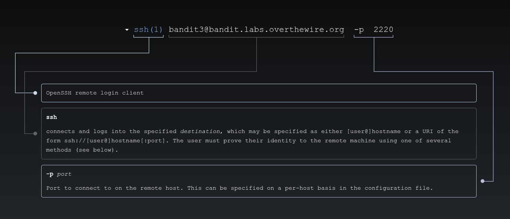
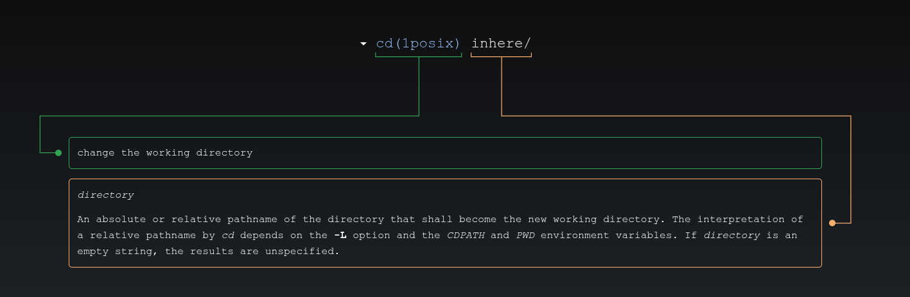
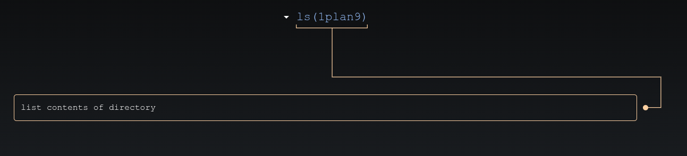
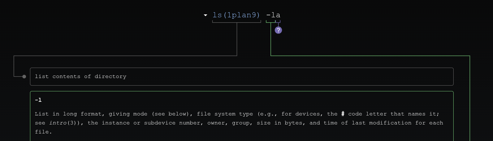
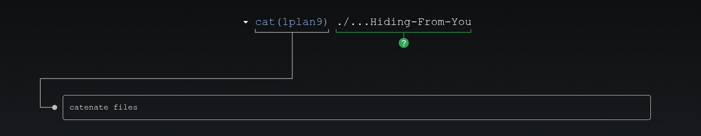

# 🎮 Bandit Level 3

---

## 📋 Level Info

| Info | Details |
|------|---------|
| **Host** | `bandit.labs.overthewire.org` |
| **Port** | `2220` |
| **Username** | `bandit3` |
| **Password** | `7ZZ2LFrykP2zEyvBl4m3clcL7tGYJPME` |
| **Goal** | Find the password for Level 4 in a hidden file |

---

## 🔧 Tools/Commands Used

| Command | Purpose |
|---------|---------|
| `ssh` | Secure Shell — remote connection |
| `cd` | Change directory |
| `ls` | List files (doesn't show hidden) |
| `ls -la` | List ALL files (including hidden) |
| `cat` | Display file contents |

---

## 🔍 Step-by-Step Solution

### Step 1: Connect to the Server

```bash
ssh bandit3@bandit.labs.overthewire.org -p 2220
```



**Password:** `7ZZ2LFrykP2zEyvBl4m3clcL7tGYJPME`

> **My Advice:** Check the directory — there might be more than meets the eye!

---

### Step 2: Explore the Directory

```bash
bandit3@bandit:~$ ls
inhere
bandit3@bandit:~$ cd inhere/
```



```bash
bandit3@bandit:~/inhere$ ls
(nothing shows up)
```



**Why is nothing showing?** The file is hidden!

---

### Step 3: Find Hidden Files

```bash
bandit3@bandit:~/inhere$ ls -la
total 12
drwxr-xr-x 2 root    root    4096 Jun 24 14:59 .
drwxr-xr-x 3 root    root    4096 Jun 24 14:59 ..
-rw-r----- 1 bandit4 bandit3   33 Jun 24 14:59 ...Hiding-From-You
```



**We found it!** A hidden file called `...Hiding-From-You`

**What does `-la` do?**
- `-l` = long format (shows permissions, owner, size)
- `-a` = all files (including hidden ones)

---

### Step 4: Read the Hidden File

```bash
bandit3@bandit:~/inhere$ cat ./...Hiding-From-You
xzTXq1rDJQVVAzdv5cHq1TQytTWufAMq
```



**Why `./...Hiding-From-You`?**
- The `./` tells the shell "look in the current directory"
- This ensures the filename is interpreted correctly

---

## 🎯 Password for Next Level

```
xzTXq1rDJQVVAzdv5cHq1TQytTWufAMq
```

---

## 📚 What I Learned

| Concept | What I Learned |
|---------|----------------|
| **Hidden Files** | Files starting with `.` are hidden |
| **`ls -la`** | Shows ALL files including hidden ones |
| **The `-a` Flag** | `a` stands for "all" files |
| **Hidden Directories** | `.` and `..` are special hidden directories |

**The Confusing Part:** At first, `ls` showed nothing. I learned that hidden files are common in Linux and you need `-a` to see them.

---

## ➡️ What's Next

# [Level 4 →](/overthewire/bandit/levels/level-4/)

---

*Hidden files taught me that in Linux, not everything is visible at first glance.*