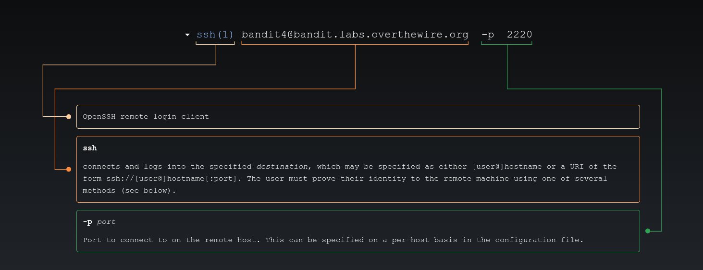
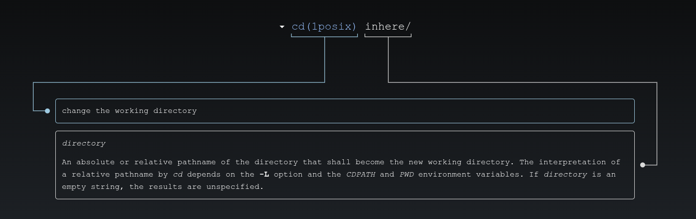
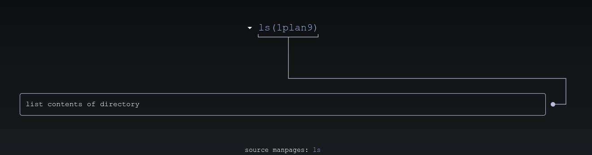
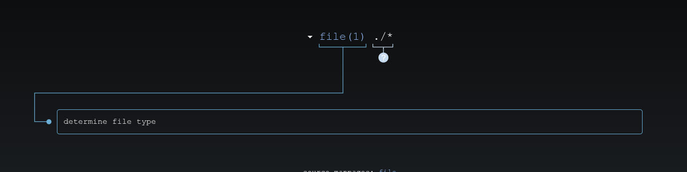
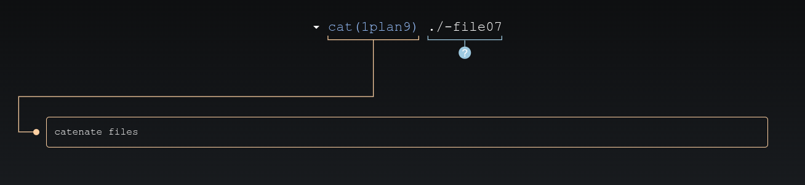

# 🎮 Bandit Level 4

---

## 📋 Level Info

| Info | Details |
|------|---------|
| **Host** | `bandit.labs.overthewire.org` |
| **Port** | `2220` |
| **Username** | `bandit4` |
| **Password** | `xzTXq1rDJQVVAzdv5cHq1TQytTWufAMq` |
| **Goal** | Find the password for Level 5 in a human-readable file |

---

## 🔧 Tools/Commands Used

| Command | Purpose |
|---------|---------|
| `ssh` | Secure Shell — remote connection |
| `cd` | Change directory |
| `ls` | List files in current directory |
| `file ./*` | Identify file types of ALL files |
| `cat` | Display file contents |

---

## 🔍 Step-by-Step Solution

### Step 1: Connect to the Server

```bash
ssh bandit4@bandit.labs.overthewire.org -p 2220
```



**Password:** `xzTXq1rDJQVVAzdv5cHq1TQytTWufAMq`

> **My Advice:** There are many files — we need to find which one is human-readable!

---

### Step 2: Explore the Directory

```bash
bandit4@bandit:~$ ls
inhere
bandit4@bandit:~$ cd inhere/
```



```bash
bandit4@bandit:~/inhere$ ls
-file00  -file01  -file02  -file03  -file04  -file05  -file06  -file07  -file08  -file09
```



**We found 10 files!** But which one has the password?

---

### Step 3: Identify File Types

```bash
bandit4@bandit:~/inhere$ file ./*
./-file00: data
./-file01: data
./-file02: OpenPGP Secret Key
./-file03: data
./-file04: data
./-file05: data
./-file06: Non-ISO extended-ASCII text, with NEL line terminators
./-file07: ASCII text
./-file08: data
./-file09: data
```



**We found it!** `-file07` is `ASCII text` — the only human-readable file!

**What does `file ./*` do?**
- `file` = identifies file types
- `./*` = all files in the current directory
- This checks every file and tells us what type it is

---

### Step 4: Read the Human-Readable File

```bash
bandit4@bandit:~/inhere$ cat ./-file07
6C7h9GD8M6ai5nr7wo1RonrzFjj9yIrG
```



**Why `./-file07`?**
- The `./` tells the shell "look in the current directory"
- This handles the `-` at the start of the filename

---

## 🎯 Password for Next Level

```
6C7h9GD8M6ai5nr7wo1RonrzFjj9yIrG
```

---

## 📚 What I Learned

| Concept | What I Learned |
|---------|----------------|
| **`file` Command** | Identifies what type of file something is |
| **`./*`** | All files in the current directory |
| **Human-Readable** | `ASCII text` files can be read with `cat` |
| **Binary vs Text** | `data` files are not human-readable |

**The Confusing Part:** At first, I tried to `cat` every file. Then I learned the `file` command can tell me which ones are readable without opening them.

---

## ➡️ What's Next

# [Level 5 →](/overthewire/bandit/levels/level-5/)

---

*The `file` command taught me to check what I'm dealing with before trying to read it.*